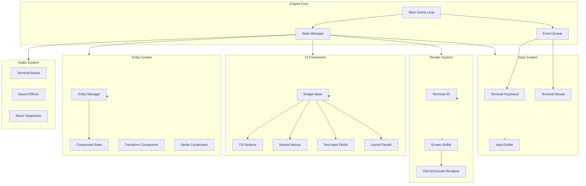

# Universal Terminal-Based Game Engine - Architecture Plan

## Overview

A **pure C/C++/H-only** cross-platform terminal user interface (TUI) game engine that works on any platform with a terminal (Linux, macOS, Windows via CMD/PowerShell/WSL). Uses only `stdio.h`, `stdlib.h`, and standard library headers.

---

## System Architecture



---

## File Structure

```
PotionGame/
├── plans/
│   └── GameEngineArchitecture.md       # This document
├── Engine/
│   ├── engine.h                        # Main engine header - entry point
│   ├── engine.cpp                      # Core game loop, initialization, shutdown
│   │
│   ├── input.h                         # Input system header
│   ├── input.cpp                       # Cross-platform terminal keyboard/mouse handling
│   │
│   ├── render.h                        # Rendering system header
│   ├── render.cpp                      # Terminal I/O, screen buffer, ASCII rendering
│   │
│   ├── ui.h                            # UI framework header
│   ├── ui.cpp                          # TUI widgets: buttons, menus, panels, text fields
│   │
│   ├── entity.h                        # Entity system header
│   ├── entity.cpp                      # Entity creation, management, destruction
│   │
│   ├── component.h                     # Component base class header
│   ├── component.cpp                   # Component system implementation
│   │
│   ├── audio.h                         # Audio system header
│   ├── audio.cpp                       # Terminal beeps, sound effects via stdio
│   │
│   └── utils/
│       ├── mathutils.h                 # Vector2D, Matrix3x3, random number gen
│       ├── mathutils.cpp
│       ├── stringutils.h               # String manipulation utilities
│       ├── stringutils.cpp
│       ├── arrayutils.h                # Improved DynamicArray with generics-style
│       └── arrayutils.cpp
│
├── Games/
│   └── PotionGame/
│       ├── GameMain.h                  # Potion game header - extends Engine
│       ├── GameMain.cpp                # Potion game implementation
│       ├── PotionShop.h                # Shop UI component
│       ├── PotionShop.cpp
│       ├── InventorySystem.h           # Inventory management
│       └── InventorySystem.cpp
│
├── Makefile                            # Cross-platform build system
├── README.md                           # Documentation and usage guide
└── .gitignore                          # Git ignore rules
```

---

## Core Engine Design

### 1. Main Engine (`engine.h` / `engine.cpp`)

The engine provides a simple API for game developers:

```cpp
// engine.h - Simplified public API
#ifndef ENGINE_H
#define ENGINE_H

// Game loop lifecycle
void Engine_Init(const char* windowTitle, int screenWidth, int screenHeight);
void Engine_Shutdown();
int  Engine_IsRunning();

// Main loop control
void Engine_SetRunning(int running);
void Engine_Run();

// Event system
typedef enum {
    EVENT_KEY_PRESS,
    EVENT_KEY_RELEASE,
    EVENT_MOUSE_MOVE,
    EVENT_MOUSE_CLICK,
    EVENT_WINDOW_RESIZE,
    EVENT_QUIT
} EventType;

typedef struct {
    EventType type;
    int keyCode;
    int mouseX, mouseY;
    int windowWidth, windowHeight;
} GameEvent;

GameEvent Engine_PollEvent();

// State management (for menus, scenes)
void Engine_PushState(void (*updateFn)(float), void (*renderFn)(void));
void Engine_PopState();
void Engine_ClearStates();

#endif // ENGINE_H
```

### 2. Input System (`input.h` / `input.cpp`)

Cross-platform terminal input using only standard C:

```cpp
// input.h - Cross-platform terminal input
#ifndef INPUT_H
#define INPUT_H

#include <stdio.h>
#include <stdlib.h>

// Platform detection and handling
#if defined(_WIN32) || defined(_WIN64)
    // Windows: use conio.h _getch() (part of MSVC runtime, standard on Windows)
    #include <conio.h>
    #define PLATFORM_WINDOWS
#else
    // Unix/Linux/macOS: use termios for raw terminal mode
    #include <termios.h>
    #include <unistd.h>
    #define PLATFORM_UNIX
#endif

// Key codes (cross-platform abstraction)
typedef enum {
    KEY_NULL = 0,
    KEY_ESCAPE, KEY_ENTER, KEY_RETURN,
    KEY_TAB, KEY_BACKSPACE,
    KEY_UP, KEY_DOWN, KEY_LEFT, KEY_RIGHT,
    KEY_HOME, KEY_END, KEY_PAGEUP, KEY_PAGEDOWN,
    KEY_F1, KEY_F2, KEY_F3, KEY_F4, KEY_F5, KEY_F6,
    KEY_F7, KEY_F8, KEY_F9, KEY_F10, KEY_F11, KEY_F12,
    KEY_DELETE,
    KEY_A = 65, KEY_B, KEY_C, KEY_D, KEY_E, KEY_F, KEY_G,
    KEY_H, KEY_I, KEY_J, KEY_K, KEY_L, KEY_M, KEY_N,
    KEY_O, KEY_P, KEY_Q, KEY_R, KEY_S, KEY_T, KEY_U,
    KEY_V, KEY_W, KEY_X, KEY_Y, KEY_Z,
    KEY_0, KEY_1, KEY_2, KEY_3, KEY_4, KEY_5, KEY_6,
    KEY_7, KEY_8, KEY_9,
    KEY_SPACE, KEY_MINUS, KEY_EQUALS, KEY_UNDERSCORE,
    // ... more keys
} KeyCode;

// Input state
typedef struct {
    int keyStates[256];        // Current frame key states
    int prevKeyStates[256];    // Previous frame key states
    int mouseX, mouseY;
    int mouseButtons[3];       // Left, middle, right
} InputState;

// Input functions
void Input_Init();
void Input_Update();
void Input_Shutdown();

int  Input_IsKeyPressed(KeyCode key);
int  Input_IsKeyReleased(KeyCode key);
int  Input_IsKeyDown(KeyCode key);
int  Input_GetMouseX();
int  Input_GetMouseY();
int  Input_IsMouseClicked(int button);

#endif // INPUT_H
```

### 3. Render System (`render.h` / `render.cpp`)

Terminal-based rendering with screen buffering:

```cpp
// render.h - Terminal rendering system
#ifndef RENDER_H
#define RENDER_H

#include <stdio.h>
#include <stdlib.h>

// Screen dimensions (set during Engine_Init)
typedef struct {
    int width;
    int height;
} ScreenSize;

// Color support (ANSI escape codes - works on all modern terminals)
typedef enum {
    COLOR_BLACK = 30,   COLOR_RED = 31,   COLOR_GREEN = 32,   COLOR_YELLOW = 33,
    COLOR_BLUE = 34,    COLOR_MAGENTA = 35, COLOR_CYAN = 36,  COLOR_WHITE = 37,
    COLOR_DEFAULT = 39
} TerminalColor;

// Screen buffer for double-buffering (prevents flicker)
typedef struct {
    char* cells;         // Character data: width * height
    int* colors;         // Color data: width * height
    int width;
    int height;
} ScreenBuffer;

// Render functions
void Render_Init(int width, int height);
void Render_Shutdown();
void Render_Clear(TerminalColor color);
void Render_Present();

// Text rendering
void Render_SetPosition(int x, int y);
void Render_Print(const char* text);
void Render_PrintColored(const char* text, TerminalColor color);
void Render_Printf(const char* format, ...);
void Render_PrintfColored(TerminalColor color, const char* format, ...);

// Unicode/box-drawing characters
#define BOX_HORIZONTAL    "\u2500"
#define BOX_VERTICAL      "\u2502"
#define BOX_TOP_LEFT      "\u250C"
#define BOX_TOP_RIGHT     "\u2510"
#define BOX_BOTTOM_LEFT   "\u2514"
#define BOX_BOTTOM_RIGHT  "\u2518"
#define BOX_CROSS         "\u253C"

// Box drawing helper
void Render_DrawBox(int x, int y, int width, int height, TerminalColor color);
void Render_DrawPanel(int x, int y, int width, int height, TerminalColor bgColor);

#endif // RENDER_H
```

### 4. UI Framework (`ui.h` / `ui.cpp`)

Widget-based TUI framework for building game menus and interfaces:

```cpp
// ui.h - TUI widget framework
#ifndef UI_H
#define UI_H

#include <stdio.h>
#include <stdlib.h>

// Widget types
typedef enum {
    WIDGET_BUTTON,
    WIDGET_LABEL,
    WIDGET_TEXT_INPUT,
    WIDGET_MENU_ITEM,
    WIDGET_PANEL,
    WIDGET_SLIDER,
    WIDGET_CHECKBOX
} WidgetType;

// Base widget
typedef struct UIWidget {
    WidgetType type;
    int x, y;
    int width, height;
    const char* text;
    int enabled;
    int focused;
    
    // Callback when interacted with
    void (*onClick)(struct UIWidget* self);
    void (*onUpdate)(struct UIWidget* self);
    
    // Parent/child for nested menus
    struct UIWidget* parent;
    struct UIWidget* nextSibling;
    struct UIWidget* child;
} UIWidget;

// Button widget
UIWidget* UI_CreateButton(int x, int y, const char* text, void (*onClick)(UIWidget*));

// Text input field
UIWidget* UI_CreateTextInput(int x, int y, int maxWidth, char* buffer, int bufferSize);

// Menu system (nested widgets)
UIWidget* UI_CreateMenu(const char* title);
void UI_AddMenuItem(UIWidget* menu, const char* text, void (*onClick)(UIWidget*));

// Panel/container
UIWidget* UI_CreatePanel(int x, int y, int width, int height);
void UI_PanelAddChild(UIWidget* panel, UIWidget* child);

// Widget lifecycle
void UI_UpdateAll();
void UI_RenderAll();
int  UI_HandleInput(UIWidget* root);  // Returns focused widget or NULL

#endif // UI_H
```

### 5. Entity System (`entity.h` / `entity.cpp`)

Simple entity-component system for game objects:

```cpp
// entity.h - Entity management
#ifndef ENTITY_H
#define ENTITY_H

#include "component.h"

typedef unsigned int EntityID;

#define MAX_ENTITIES 1024

typedef struct {
    EntityID id;
    int active;
    Component* components[MAX_COMPONENTS];
} Entity;

// Entity functions
EntityID Entity_Create();
void     Entity_Destroy(EntityID id);
int      Entity_IsActive(EntityID id);

// Component attachment
void Entity_AddComponent(EntityID id, ComponentType type, void* data);
void* Entity_GetComponent(EntityID id, ComponentType type);

#endif // ENTITY_H
```

### 6. Audio System (`audio.h` / `audio.cpp`)

Terminal-based audio using standard library:

```cpp
// audio.h - Terminal audio system
#ifndef AUDIO_H
#define AUDIO_H

#include <stdio.h>

// Sound effect definitions
typedef struct {
    int frequency;   // Hz (for terminal beep)
    int duration;    // milliseconds
} SoundEffect;

// Audio functions
void Audio_Init();
void Audio_Shutdown();

// Play a simple tone (works everywhere)
void Audio_PlayTone(int frequency, int duration_ms);

// Play a sound effect
void Audio_PlaySound(const SoundEffect* sound);

// Beep (terminal bell character)
void Audio_Beep();

// Music sequencer (simple melody playback)
typedef struct {
    int notes[64];      // Frequencies
    int durations[64];  // Durations in ms
    int length;
} Melody;

void Audio_PlayMelody(const Melody* melody);
void Audio_StopMusic();

#endif // AUDIO_H
```

---

## Cross-Platform Build System (`Makefile`)

The Makefile handles compilation on Linux, macOS, and Windows (via MinGW/WSL):

```makefile
# Platform detection
UNAME := $(shell uname -s)

# Compiler selection
CC = gcc
CFLAGS = -std=c11 -Wall -Wextra
LDFLAGS =

ifeq ($(UNAME), Linux)
    CFLAGS += -DPLATFORM_LINUX
endif

ifeq ($(UNAME), Darwin)
    CFLAGS += -DPLATFORM_MACOS
endif

# Source files
ENGINE_SRC = Engine/engine.cpp Engine/input.cpp Engine/render.cpp \
             Engine/ui.cpp Engine/entity.cpp Engine/component.cpp \
             Engine/audio.cpp Engine/utils/mathutils.cpp \
             Engine/utils/stringutils.cpp Engine/utils/arrayutils.cpp

GAME_SRC = Games/PotionGame/GameMain.cpp Games/PotionGame/PotionShop.cpp \
           Games/PotionGame/InventorySystem.cpp

# Build targets
all: engine_demo potion_game

engine_demo: $(ENGINE_SRC)
	$(CC) $(CFLAGS) -o engine_demo $(ENGINE_SRC) $(LDFLAGS)

potion_game: $(ENGINE_SRC) $(GAME_SRC)
	$(CC) $(CFLAGS) -o potion_game $(ENGINE_SRC) $(GAME_SRC) $(LDFLAGS)

clean:
	rm -f engine_demo potion_game

run: potion_game
	./potion_game
```

---

## Game Development Workflow

With this engine, creating a game is as simple as:

```cpp
// Games/PotionGame/GameMain.cpp - Example game code
#include "../Engine/engine.h"
#include "../Engine/ui.h"

void MainMenu_OnClick(UIWidget* widget) {
    // Handle menu selection
}

void GameUpdate(float deltaTime) {
    // Update game logic here
}

void GameRender(void) {
    // Render game here
}

int main() {
    // Initialize engine (one line!)
    Engine_Init("Potion Master", 80, 24);
    
    // Create menu (few lines!)
    UIWidget* menu = UI_CreateMenu("Potion Master");
    UI_AddMenuItem(menu, "New Game", MainMenu_OnClick);
    UI_AddMenuItem(menu, "Load Game", MainMenu_OnClick);
    UI_AddMenuItem(menu, "Settings", MainMenu_OnClick);
    UI_AddMenuItem(menu, "Exit", MainMenu_OnClick);
    
    // Set up game states
    Engine_PushState(GameUpdate, GameRender);
    
    // Run the game (one line!)
    Engine_Run();
    
    // Cleanup (one line!)
    Engine_Shutdown();
    
    return 0;
}
```

---

## Key Design Principles

1. **Zero external dependencies** - Only `stdio.h`, `stdlib.h`, and platform-specific standard headers
2. **Cross-platform by default** - Works on Linux, macOS, Windows (CMD/PowerShell/WSL)
3. **Simple API** - Game development should be trivial: init, create UI, run, shutdown
4. **Terminal-native rendering** - Uses ANSI escape codes for colors and box-drawing characters
5. **Double-buffered display** - Prevents screen flicker
6. **Event-driven input** - Clean event loop with keyboard and mouse support
7. **Widget-based UI** - Composable UI elements for menus, buttons, text fields
8. **Entity system** - Flexible game object management

---

## Platform-Specific Notes

| Feature | Linux | macOS | Windows |
|---------|-------|-------|---------|
| Keyboard input | `termios` raw mode | `termios` raw mode | `_getch()` from conio.h |
| Mouse input | ANSI mouse tracking | ANSI mouse tracking | Console API (via fallback) |
| Colors | ANSI 256-color | ANSI 256-color | ANSI escape codes (modern CMD) |
| Terminal control | `termios` | `termios` | Virtual Console API |

---

## Migration from Existing Code

The existing custom `String`, `DynamicArray`, and `Potion` classes will be:
1. Integrated into the Engine/utils/ directory as improved utility classes
2. Enhanced with engine-specific features (engine-compatible string formatting, etc.)
3. Maintained for backward compatibility with the PotionGame code

---

## Next Steps

1. Pull from GitHub remote repository
2. Create all engine source files following this architecture
3. Build and test on current platform
4. Verify cross-platform compilation via Makefile
5. Push complete project to GitHub
